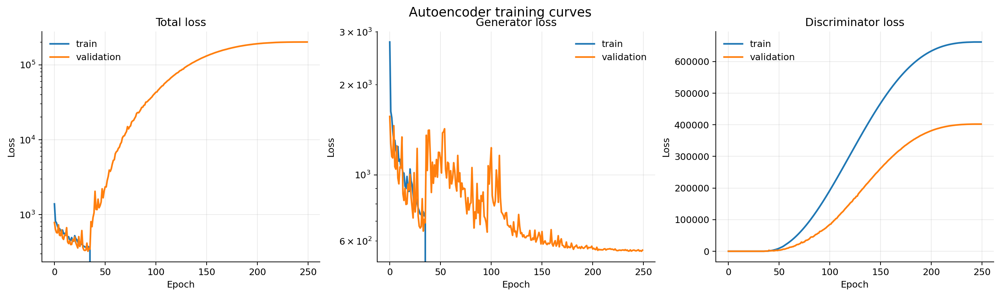
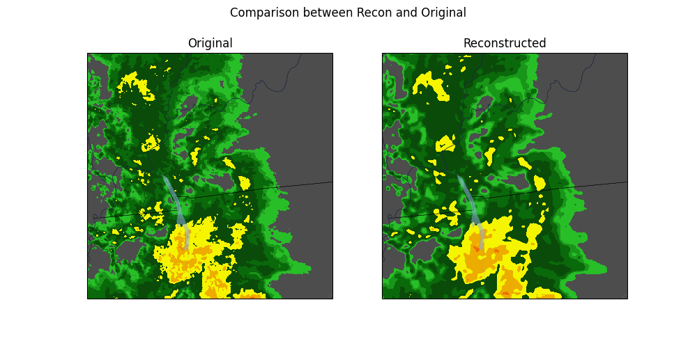
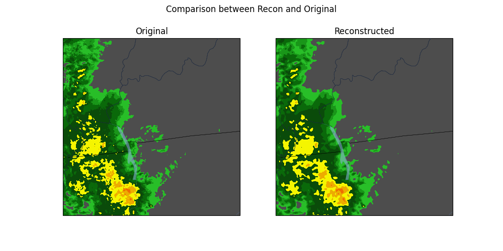
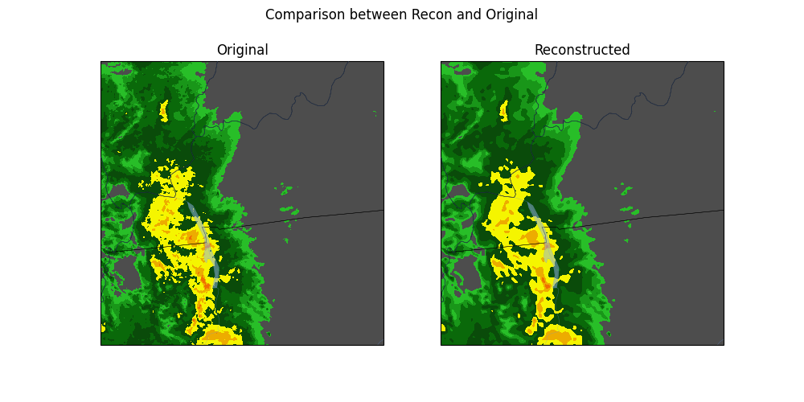
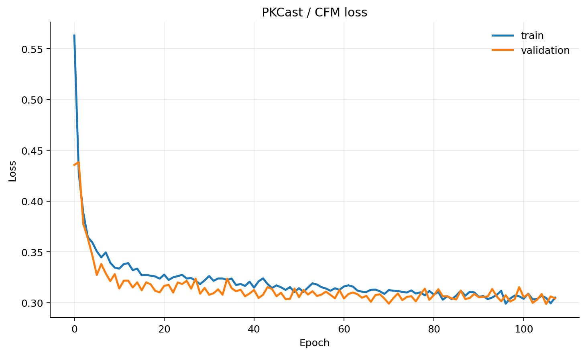
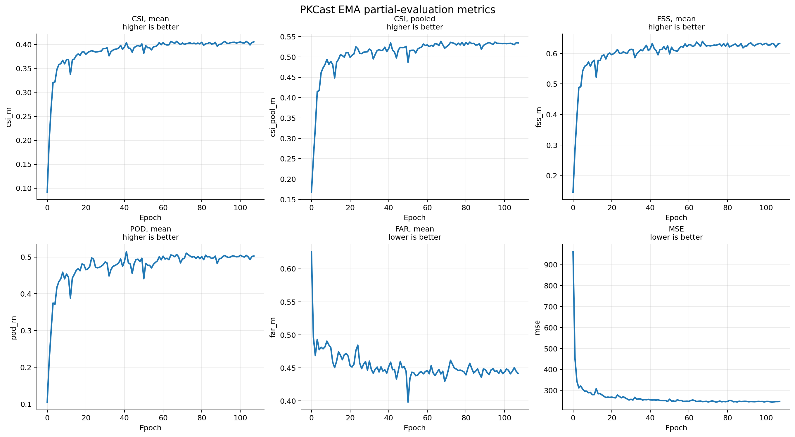
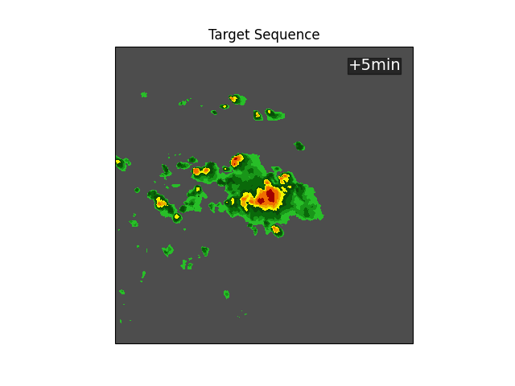
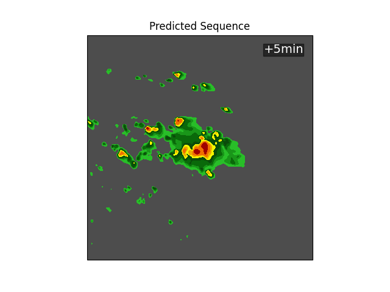
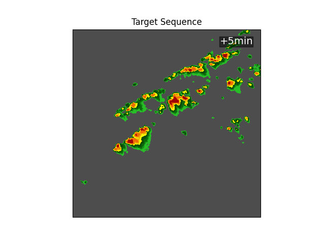
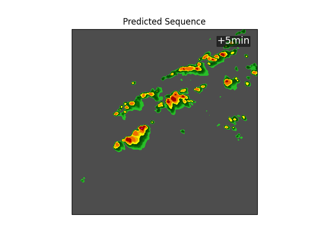

# PKCast

PKCast is a project for probabilistic radar nowcasting on the SEVIR VIL dataset. It trains a VAE-style autoencoder to compress radar frames, encodes the raw SEVIR sequences into latent HDF5 files, then trains a Conditional Flow Matching model with a Cuboid Transformer UNet backbone to forecast future radar frames in latent space.


## Results

The plots below were generated from the local MLflow SQLite store (`mlruns.db`) and the saved artifacts in `artifacts/sevir/`.

### Autoencoder training curves



### VAE reconstructions

These examples show validation reconstructions from the VAE over training.

**Early training**



**Mid training**



**Late training**



### PKCast training curves



### PKCast partial-evaluation metrics



### PKCast sample forecasts

**Sample 1**

| Ground truth | PKCast prediction |
| --- | --- |
|  |  |

**Sample 2**

| Ground truth | PKCast prediction |
| --- | --- |
|  |  |

## What is included

- Distributed VAE training for SEVIR VIL frames.
- Latent dataset generation from a trained autoencoder.
- Distributed PKCast/CFM training on latent SEVIR sequences.
- Single-sample inference that decodes forecasts and saves GIF and NPZ outputs.
- Streaming nowcasting metrics and Cartopy-based visualization utilities.
- Slurm launch scripts for autoencoder training, CFM training, and inference.

## Repository layout

```text
pkcast/                 Main installable package
  models/               Cuboid Transformer / PKCast model code
  autoencoder/          Autoencoder loss and early-stopping utilities
  cfm/                  Conditional flow matching implementation
  metrics/              Streaming probabilistic nowcasting metrics
  data/                 SEVIR PyTorch dataset classes
  visualization/        Plotting, animation, and Cartopy helpers
  utils/                Shared training and interpolation helpers
configs/                YAML configuration files
scripts/                Training, evaluation, and preprocessing entry points
datasets/sevir/         SEVIR preprocessing and local data files
slurm/                  Cluster job scripts
artifacts/              Model checkpoints and generated inference outputs
mlruns/                 MLflow experiment output
```

## Setup

Create and activate an environment, then install the project dependencies.

```bash
conda create -n nowcasting python=3.10
conda activate nowcasting

pip install -r requirements.txt
```

Install a CUDA-compatible PyTorch build separately for your cluster or workstation. The training scripts also import `mlflow`, so install it if it is not already present in your environment:

```bash
pip install mlflow
```

For Cartopy visual overlays, the system may also need GEOS/PROJ dependencies installed through your package manager or Conda.

## Data

The scripts expect SEVIR VIL data in HDF5 files with a dataset named `vil`, plus matching metadata CSV files. The default raw data paths are:

```text
datasets/sevir/data/sevir_full/nowcast_training_full.h5
datasets/sevir/data/sevir_full/nowcast_training_full_META.csv
datasets/sevir/data/sevir_full/nowcast_validation_full.h5
datasets/sevir/data/sevir_full/nowcast_validation_full_META.csv
datasets/sevir/data/sevir_full/nowcast_testing_full.h5
datasets/sevir/data/sevir_full/nowcast_testing_full_META.csv
```

PKCast training uses VAE-encoded latent files by default:

```text
datasets/sevir/data/sevir_latent_vae/nowcast_training_full.h5
datasets/sevir/data/sevir_latent_vae/nowcast_training_full_META.csv
datasets/sevir/data/sevir_latent_vae/nowcast_validation_full.h5
datasets/sevir/data/sevir_latent_vae/nowcast_validation_full_META.csv
```

The default sequence configuration uses 13 input frames and predicts 12 future frames.

## Training workflow

### 1. Train the autoencoder

```bash
torchrun \
  --standalone \
  --nnodes=1 \
  --nproc_per_node=4 \
  scripts/train_autoencoder.py \
  --config configs/autoencoder.yaml \
  --train_file datasets/sevir/data/sevir_full/nowcast_training_full.h5 \
  --train_meta datasets/sevir/data/sevir_full/nowcast_training_full_META.csv \
  --val_file datasets/sevir/data/sevir_full/nowcast_validation_full.h5 \
  --val_meta datasets/sevir/data/sevir_full/nowcast_validation_full_META.csv
```

Checkpoints are written under `artifacts/sevir/autoencoder_kl/<run_id>/models/`. The best checkpoint is typically named `early_stopping_model.pt`.

### 2. Generate the latent SEVIR dataset

After training the autoencoder, encode the raw train and validation splits:

```bash
python scripts/encode_dataset.py \
  --config configs/autoencoder.yaml \
  --preload_model artifacts/sevir/autoencoder_kl/<run_id>/models/early_stopping_model.pt \
  --out_dir datasets/sevir/data/sevir_latent_vae
```

This creates latent HDF5 files and updated metadata CSVs in `datasets/sevir/data/sevir_latent_vae/`.

### 3. Train PKCast / CFM

Update `autoencoder_params.autoencoder_checkpoint` in `configs/pkcast.yaml` if needed, then run:

```bash
torchrun \
  --standalone \
  --nnodes=1 \
  --nproc_per_node=8 \
  scripts/train_pkcast.py \
  --config configs/pkcast.yaml \
  --train_file datasets/sevir/data/sevir_latent_vae/nowcast_training_full.h5 \
  --train_meta datasets/sevir/data/sevir_latent_vae/nowcast_training_full_META.csv \
  --val_file datasets/sevir/data/sevir_latent_vae/nowcast_validation_full.h5 \
  --val_meta datasets/sevir/data/sevir_latent_vae/nowcast_validation_full_META.csv \
  --partial_evaluation_file datasets/sevir/data/sevir_full/nowcast_validation_full.h5 \
  --partial_evaluation_meta datasets/sevir/data/sevir_full/nowcast_validation_full_META.csv
```

PKCast checkpoints are written under `artifacts/sevir/pkcast/<run_id>/models/`.

## Inference

Generate input, target, and predicted GIFs for one test sample:

```bash
python scripts/inference.py \
  --config configs/pkcast.yaml \
  --cfm_checkpoint artifacts/sevir/pkcast/<run_id>/models/early_stopping_model.pt \
  --vae_checkpoint artifacts/sevir/autoencoder_kl/<run_id>/models/early_stopping_model.pt \
  --test_file datasets/sevir/data/sevir_full/nowcast_testing_full.h5 \
  --test_meta datasets/sevir/data/sevir_full/nowcast_testing_full_META.csv \
  --sample_index 0 \
  --probabilistic_samples 1 \
  --output_dir artifacts/sevir/inference_gif
```

Outputs are saved as:

```text
sample_00000_input.gif
sample_00000_target.gif
sample_00000_prediction.gif
sample_00000_prediction.npz
```

Use `--cartopy_features` to add geographic overlays to the generated GIFs.

## Evaluation results

Results on 3% of the SEVIR VIL test set (checkpoint `2026-04-22`, 1 probabilistic sample, 13 input / 12 forecast frames at 1-minute spacing).

### Summary metrics

| Metric | Value |
|--------|-------|
| MSE | 472.46 |
| CSI-M (mean) | 0.438 |
| CSI-M 16×16-pooled | 0.565 |
| HSS-M | 0.551 |
| POD-M | 0.544 |
| FAR-M | 0.397 |
| CRPS | 7.933 |
| CRPS (scaled) | 0.031 |

### CSI-M by VIL threshold

| Threshold | CSI | CSI (16-pooled) | HSS | POD | FAR |
|-----------|-----|-----------------|-----|-----|-----|
| 16 | 0.777 | 0.807 | 0.833 | 0.874 | 0.128 |
| 74 | 0.666 | 0.730 | 0.768 | 0.787 | 0.195 |
| 133 | 0.410 | 0.577 | 0.555 | 0.546 | 0.403 |
| 160 | 0.331 | 0.500 | 0.473 | 0.446 | 0.471 |
| 181 | 0.279 | 0.454 | 0.412 | 0.380 | 0.526 |
| 219 | 0.167 | 0.318 | 0.265 | 0.229 | 0.659 |

### CSI-M by lead time (minutes +1 to +12)

| Lead (min) | CSI-M | CSI-M (16-pooled) | CSI-M @ thr=219 |
|------------|-------|-------------------|-----------------|
| +1 | 0.703 | 0.799 | 0.489 |
| +2 | 0.602 | 0.720 | 0.337 |
| +3 | 0.534 | 0.663 | 0.254 |
| +4 | 0.485 | 0.620 | 0.199 |
| +5 | 0.449 | 0.583 | 0.165 |
| +6 | 0.419 | 0.553 | 0.138 |
| +7 | 0.395 | 0.529 | 0.114 |
| +8 | 0.376 | 0.505 | 0.100 |
| +9 | 0.359 | 0.486 | 0.088 |
| +10 | 0.339 | 0.463 | 0.067 |
| +11 | 0.314 | 0.441 | 0.035 |
| +12 | 0.283 | 0.411 | 0.014 |

## Slurm

The `slurm/` directory contains cluster launch scripts with the current project paths and Conda environment:

```bash
sbatch slurm/train_autoencoder.sbatch
sbatch slurm/train_pkcast.sbatch
sbatch slurm/inference.sbatch
```

Edit the partition, GPU count, environment name, and data paths in these files before running on a different cluster.

## Configuration

Main configuration files:

- `configs/autoencoder.yaml`
- `configs/pkcast.yaml`

Key settings include batch size, number of epochs, optimizer and scheduler options, VAE architecture, PKCast model depth, number of input and target frames, partial evaluation settings, and checkpoint paths.

## Experiment tracking

Training scripts use MLflow when `run_params.enable_mlflow` is true. Local run data is written to `mlruns/` and `mlruns.db`.

To inspect runs locally:

```bash
mlflow ui --backend-store-uri sqlite:///mlruns.db
```

Then open the MLflow URL printed by the command.
