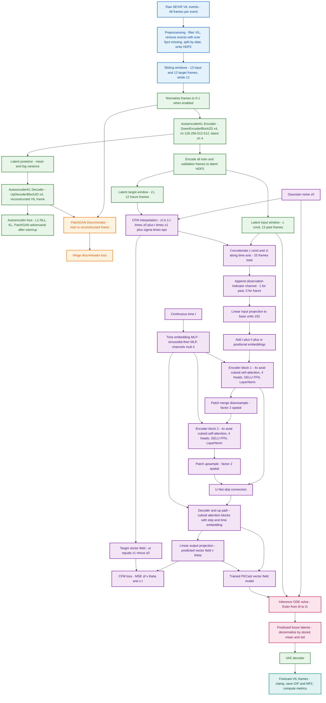

# PKCast

PKCast is a project for probabilistic radar nowcasting on the SEVIR VIL dataset. It trains a VAE-style autoencoder to compress radar frames, encodes the raw SEVIR sequences into latent HDF5 files, then trains a Conditional Flow Matching model with a Cuboid Transformer UNet backbone to forecast future radar frames in latent space.


## Results

The plots below were generated from the local MLflow SQLite store (`mlruns.db`) and the saved artifacts in `artifacts/sevir/`.

### Autoencoder training curves


### VAE reconstructions

These examples show validation reconstructions from the VAE over training.

**Early training**


**Mid training**


**Late training**


### PKCast training curves


### PKCast partial-evaluation metrics


### PKCast sample forecasts

**Sample 1**

| Ground truth | PKCast prediction |
| --- | --- |
|  |  |

**Sample 2**

| Ground truth | PKCast prediction |
| --- | --- |
|  |  |

## What is included

- Distributed VAE training for SEVIR VIL frames.
- Latent dataset generation from a trained autoencoder.
- Distributed PKCast/CFM training on latent SEVIR sequences.
- Single-sample inference that decodes forecasts and saves GIF and NPZ outputs.
- Streaming nowcasting metrics and Cartopy-based visualization utilities.
- Slurm launch scripts for autoencoder training, PKCast training, and inference.

## Repository layout

```text
pkcast/                 Main installable package
  models/               Cuboid Transformer / PKCast model code
  autoencoder/          Autoencoder loss and early-stopping utilities
  cfm/                  Conditional flow matching implementation
  metrics/              Streaming probabilistic nowcasting metrics
  data/                 SEVIR PyTorch dataset classes
  visualization/        Plotting, animation, and Cartopy helpers
  utils/                Shared training and interpolation helpers
configs/                YAML configuration files
scripts/                Training, evaluation, and preprocessing entry points
datasets/sevir/         SEVIR preprocessing and local data files
slurm/                  Cluster job scripts
artifacts/              Model checkpoints and generated inference outputs
mlruns/                 MLflow experiment output
```

## Setup

Create and activate an environment, then install the project dependencies.

```bash
conda create -n nowcasting python=3.10
conda activate nowcasting

pip install -r requirements.txt
```

Install a CUDA-compatible PyTorch build separately for your cluster or workstation. The training scripts also import `mlflow`, so install it if it is not already present in your environment:

```bash
pip install mlflow
```

For Cartopy visual overlays, the system may also need GEOS/PROJ dependencies installed through your package manager or Conda.

## Data

The scripts expect SEVIR VIL data in HDF5 files with a dataset named `vil`, plus matching metadata CSV files.

SEVIR VIL dataset download: https://registry.opendata.aws/sevir/

The dataset is hosted in the public S3 bucket `s3://sevir`. To download only the VIL files and catalog with the AWS CLI:

```bash
aws s3 cp --no-sign-request s3://sevir/CATALOG.csv CATALOG.csv
aws s3 sync --no-sign-request s3://sevir/data/vil datasets/sevir/data/vil
```

The default raw data paths are:

```text
datasets/sevir/data/sevir_full/nowcast_training_full.h5
datasets/sevir/data/sevir_full/nowcast_training_full_META.csv
datasets/sevir/data/sevir_full/nowcast_validation_full.h5
datasets/sevir/data/sevir_full/nowcast_validation_full_META.csv
datasets/sevir/data/sevir_full/nowcast_testing_full.h5
datasets/sevir/data/sevir_full/nowcast_testing_full_META.csv
```

PKCast training uses VAE-encoded latent files by default:

```text
datasets/sevir/data/sevir_latent_vae/nowcast_training_full.h5
datasets/sevir/data/sevir_latent_vae/nowcast_training_full_META.csv
datasets/sevir/data/sevir_latent_vae/nowcast_validation_full.h5
datasets/sevir/data/sevir_latent_vae/nowcast_validation_full_META.csv
```

The default sequence configuration uses 13 input frames and predicts 12 future frames.

## Preprocessing and windowing

The raw SEVIR catalog is first filtered to the `vil` image type, and events with more than 5% missing frames are removed. The remaining events are split by timestamp: training events occur before `2019-01-01 00:00:00`, validation events occur from `2019-01-01 00:00:00` up to `2019-06-01 00:00:00`, and testing events occur on or after `2019-06-01 00:00:00`. Each split is written to a compressed HDF5 file with a `vil` dataset, and the matching metadata CSV keeps event fields such as IDs, timestamps, projection bounds, and a `file_row` index for fast lookup. The preprocessing script also supports optional bicubic spatial downsampling through `--downsample_factor`.

```bash
python scripts/preprocess_data.py \
  --catalog_csv_path datasets/sevir/data/sevir_complete/CATALOG.csv \
  --data_dir datasets/sevir/data/sevir_complete/data \
  --output_dir datasets/sevir/data/sevir_full \
  --img_type vil
```

During training, each SEVIR event is treated as a 49-frame sequence. The dataset loader creates sliding windows with:

```text
window_length = (lag_time + lead_time) * time_spacing
```

With the default configuration, `lag_time=13`, `lead_time=12`, and `time_spacing=1`, so each window contains 25 frames. The first 13 frames become the model input, and the next 12 frames become the forecast target. The default stride is 12 frames, so a 49-frame event produces three windows starting at frames 0, 12, and 24. This turns one storm event into multiple supervised nowcasting examples while preserving temporal order.

After the VAE autoencoder is trained, `scripts/encode_dataset.py` reads the processed train and validation HDF5 files, normalizes frames when enabled in the autoencoder config, encodes every frame into the VAE latent space, and writes new latent HDF5 files under `datasets/sevir/data/sevir_latent_vae/`. PKCast then trains on these latent windows instead of directly forecasting full-resolution radar frames.

## End-to-end architecture

PKCast is a two-stage latent nowcasting system. First, a VAE-style autoencoder learns a compact representation of individual VIL radar frames. Second, a Conditional Flow Matching model learns to generate the future latent sequence conditioned on the past latent sequence. At inference time, the system starts from Gaussian noise in the future latent space, integrates the learned vector field from `t=0` to `t=1`, and decodes the final latent forecast back to radar frames.



### Autoencoder stage

The autoencoder is built with `diffusers.models.autoencoders.AutoencoderKL`. It receives single-channel VIL frames and reconstructs the same frame after passing through a 4-channel latent bottleneck. The configured encoder uses four `DownEncoderBlock2D` stages with channel widths `[128, 256, 512, 512]`, `silu` activations, group normalization with 32 groups, and two layers per block. The decoder mirrors this with four `UpDecoderBlock2D` stages. Training uses distributed data parallelism, AdamW, cosine warmup scheduling, gradient clipping, MLflow logging, and early stopping.

The generator side of the autoencoder loss is:

$$\mathcal{L}_{\text{AE}} = \mathcal{L}_{\text{NLL}} + \lambda_{\text{KL}}\,\mathcal{L}_{\text{KL}} + w_{\text{adapt}}\cdot d_{\text{factor}}\cdot\mathcal{L}_{\text{GAN}}$$

where $\lambda_{\text{KL}} = 10^{-4}$ and `disc_weight=0.5` in `configs/autoencoder.yaml`. $\mathcal{L}_{\text{NLL}}$ is based on absolute reconstruction error with a learned scalar log variance. $\mathcal{L}_{\text{KL}}$ regularizes the posterior distribution from the VAE encoder. $\mathcal{L}_{\text{GAN}} = -\mathbb{E}[D(\hat{\mathbf{x}})]$ encourages sharper reconstructions once the discriminator is enabled.

The discriminator is a 3-layer PatchGAN-style convolutional discriminator from `pkcast/autoencoder/losses/lpips.py`. It receives real VIL frames and reconstructed VIL frames and is trained with hinge loss:

$$\mathcal{L}_{D} = \frac{1}{2}\,\mathbb{E}\!\left[\max(0,\, 1 - D(\mathbf{x}))\right] + \frac{1}{2}\,\mathbb{E}\!\left[\max(0,\, 1 + D(\hat{\mathbf{x}}))\right]$$

The discriminator is inactive for the first `warmup_generator_epochs=35` epochs, so the autoencoder first learns stable reconstructions before adversarial training begins. After warmup, the training loop performs one generator update and one discriminator update per batch. The file name `lpips.py` and class name `LPIPSWithDiscriminator` come from the original perceptual/adversarial loss implementation, but this project's version explicitly removes the perceptual LPIPS term. In the current code, the active autoencoder losses are reconstruction/NLL, KL, and PatchGAN adversarial losses.

### Latent dataset stage

After the autoencoder is trained, `scripts/encode_dataset.py` loads the best autoencoder checkpoint and encodes each processed VIL event frame-by-frame. If `normalize_dataset` is enabled in the autoencoder config, frames are divided by 255 before encoding. The encoder posterior mode is used as the deterministic latent representation, then latents are saved to compressed HDF5 files with dataset name `vil`. The latent tensor layout is `(H_latent, W_latent, T, C_latent)`, where `C_latent=4`.

### PKCast / CFM stage

PKCast trains on latent windows instead of raw radar frames. The conditioning input is the 13-frame past latent sequence, and the target is the 12-frame future latent sequence. Before training, the latent training set mean and standard deviation are computed and stored in the model so both conditioning latents and target latents can be normalized consistently.

The forecasting model is `CuboidTransformerUNet`, a U-Net-style spatiotemporal transformer adapted from Cuboid Transformer / PreDiff-style blocks. It concatenates the observed latent sequence and the noisy future latent state along time, appends an observation indicator channel that marks past frames as observed and future frames as generated, projects the tensor into `base_units=192`, adds `t+h+w` positional embeddings, and injects a continuous-time embedding into each block. The configured network uses two resolution levels with depth `[4, 4]`, axial cuboid self-attention, 4 attention heads, patch-merge downsampling, 3D upsampling, relative position encoding, GELU feed-forward layers, and U-Net residual connections.

Conditional Flow Matching trains the model to predict a vector field that transports random Gaussian noise into the target future latent sequence. For each batch:

$$\mathbf{z}_0 \sim \mathcal{N}(\mathbf{0}, \mathbf{I}), \qquad \mathbf{z}_1 = \text{target future latent sequence}, \qquad t \sim \mathcal{U}(0, 1)$$

$$\mathbf{z}_t = (1 - t)\,\mathbf{z}_0 + t\,\mathbf{z}_1 + \sigma\,\boldsymbol{\varepsilon}, \qquad \boldsymbol{\varepsilon} \sim \mathcal{N}(\mathbf{0}, \mathbf{I})$$

$$\mathbf{u}_t = \mathbf{z}_1 - \mathbf{z}_0$$

$$\mathcal{L}_{\text{CFM}} = \mathbb{E}\!\left[\left\| v_\theta(t,\, \mathbf{z}_t,\, \mathbf{z}_{\text{cond}}) - \mathbf{u}_t \right\|^2\right]$$

The current CFM config uses the vanilla flow matcher with `sigma=0.01`. Training uses AdamW, cosine warmup scheduling, mixed precision, gradient accumulation support, gradient clipping, EMA model tracking with decay `0.999`, MLflow logging, validation loss, early stopping on `partial_csi_m`, and optional partial evaluation. During partial evaluation and inference, the model samples future latents by solving the learned ODE from Gaussian noise:

$$\frac{d\mathbf{z}}{dt} = v_\theta\!\left(t,\, \mathbf{z},\, \mathbf{z}_{\text{cond}}\right), \qquad \mathbf{z}(0) \sim \mathcal{N}(\mathbf{0}, \mathbf{I}), \qquad \hat{\mathbf{z}}_1 = \mathbf{z}(1)$$

The implementation uses Euler integration from `t=0` to `t=1`, denormalizes the generated latents, decodes them through the trained VAE decoder, clamps output VIL values to `[0, 255]`, and saves forecast animations plus NumPy arrays. Metrics include MSE, CRPS, CSI, pooled CSI, HSS, FAR, POD, and FSS.

## Background

### Conditional Flow Matching vs diffusion models

Both diffusion models and flow matching start from the same goal: learn to turn random Gaussian noise into data samples. The difference is *how* they define the path between noise and data, and what the model is trained to predict.

#### The taxi dispatcher analogy

Imagine you are a taxi dispatcher. You have drivers (noise samples $\mathbf{z}_0$) scattered randomly across a country, and you need to get each one to a specific city (data sample $\mathbf{z}_1$).

**Diffusion models** first destroy all the roads — scatter every driver into pure chaos over ~1000 steps using a fixed noisy schedule. Then train a model to reverse that destruction step by step. The reversal is hard because at each step the model only gets a noisy signal about where to go, and the signal gets weaker near the start of generation.

**Conditional Flow Matching** draws a straight road directly from each driver to their destination. It trains a model to predict the direction of that road (the vector field). At inference, release a new driver from a random location and let the model push them to a destination in one smooth continuous trip.

#### Mathematics

Diffusion trains a model to predict added noise $\boldsymbol{\varepsilon}$ at each noisy timestep:

$$\mathbf{x}_t = \sqrt{\bar{\alpha}_t}\,\mathbf{x}_0 + \sqrt{1 - \bar{\alpha}_t}\,\boldsymbol{\varepsilon}$$

$$\mathcal{L}_{\text{diff}} = \left\| \boldsymbol{\varepsilon}_\theta(\mathbf{x}_t, t) - \boldsymbol{\varepsilon} \right\|^2$$

The noise schedule is fixed (cosine or linear), uses ~1000 steps, and paths curve through a high-entropy space. The target $\boldsymbol{\varepsilon}$ is indirect — the model predicts the noise that was added, not the direction toward the data.

Flow Matching trains a model to predict a **vector field** $\mathbf{u}_t$ that points directly from noise toward data along a straight line. For $t \in [0, 1]$:

$$\mathbf{z}_t = (1 - t)\,\mathbf{z}_0 + t\,\mathbf{z}_1 + \sigma\,\boldsymbol{\varepsilon}$$

$$\mathbf{u}_t = \mathbf{z}_1 - \mathbf{z}_0$$

$$\mathcal{L}_{\text{CFM}} = \left\| v_\theta(t,\, \mathbf{z}_t,\, \mathbf{z}_{\text{cond}}) - \mathbf{u}_t \right\|^2$$

The target direction $\mathbf{u}_t = \mathbf{z}_1 - \mathbf{z}_0$ is **analytically exact and constant along the path** — no approximation. The model learns to reproduce this direction for any $(t, \mathbf{z}_t, \mathbf{z}_{\text{cond}})$ triple.

#### Key differences

| Property | Diffusion | Flow Matching |
|---|---|---|
| Path shape | Curved, noisy multi-step degradation | Straight line from $\mathbf{z}_0$ to $\mathbf{z}_1$ |
| Training target | Predict added noise $\boldsymbol{\varepsilon}$ (indirect) | Predict direction $\mathbf{z}_1 - \mathbf{z}_0$ (direct, exact) |
| Inference steps | 50–1000 DDIM/DDPM steps | 10–20 Euler steps |
| Training signal quality | Weak and noisy at high $t$ | Clean constant target at all $t$ |
| Inference speed | Slow | 5–10× faster |
| Conditioning | Add class/text embedding | Concatenate $\mathbf{z}_{\text{cond}}$ along time axis |

#### Why CFM suits spatiotemporal forecasting

Each inference step in PKCast is a full CuboidTransformer forward pass over a $48 \times 48 \times 25 \times 4$ latent tensor. At 10 Euler steps vs 1000 diffusion steps, the cost difference is 100×. Straight paths also avoid the high-noise regime where diffusion models lose spatial coherence — important for preserving storm cell structure across 12 forecast frames.

---

### Euler integration for ODE solving

The CFM inference problem is to solve this ordinary differential equation:

$$\frac{d\mathbf{z}}{dt} = v_\theta\!\left(t,\, \mathbf{z},\, \mathbf{z}_{\text{cond}}\right), \qquad \mathbf{z}(0) \sim \mathcal{N}(\mathbf{0}, \mathbf{I})$$

Starting from random noise at $t = 0$, integrate the learned vector field forward to $t = 1$ to get the forecast.

#### What Euler integration does

Euler's method approximates a continuous path by taking small discrete steps. At each step, evaluate the vector field at the current position and move in that direction by a small amount $\Delta t$.

**Analogy:** you are navigating a river in fog. You cannot see the full path. At each moment you feel which way the current is pulling you and paddle in that direction for a few seconds, then check again. More checks (smaller $\Delta t$) means a more accurate path but more effort.

#### Euler step formula

Given $N$ total steps and step size $\Delta t = \tfrac{1}{N}$:

$$\mathbf{z}_0 \sim \mathcal{N}(\mathbf{0}, \mathbf{I})$$

$$\mathbf{z}_{i+1} = \mathbf{z}_i + \Delta t \cdot v_\theta\!\left(t_i,\, \mathbf{z}_i,\, \mathbf{z}_{\text{cond}}\right), \qquad t_i = \frac{i}{N}$$

$$\hat{\mathbf{z}}_1 = \mathbf{z}_N \quad \text{(forecast latents)}$$

#### Concrete example with $N = 4$ steps

Suppose the model forecasts one scalar latent value with $\mathbf{z}_{\text{cond}}$ fixed. True target $z_1 = 3.0$, noise start $z_0 = -1.0$, ideal direction $u = z_1 - z_0 = 4.0$, step size $\Delta t = 0.25$.

| Step $i$ | $t_i$ | $z_i$ | $v_\theta$ (predicted) | $z_{i+1} = z_i + 0.25 \cdot v_\theta$ |
|----------|--------|--------|------------------------|----------------------------------------|
| 0 | 0.00 | $-1.00$ | $3.95$ | $-1.00 + 0.25 \times 3.95 = \mathbf{-0.01}$ |
| 1 | 0.25 | $-0.01$ | $4.01$ | $-0.01 + 0.25 \times 4.01 = \mathbf{0.99}$ |
| 2 | 0.50 | $0.99$ | $3.98$ | $0.99 + 0.25 \times 3.98 = \mathbf{2.00}$ |
| 3 | 0.75 | $2.00$ | $4.02$ | $2.00 + 0.25 \times 4.02 = \mathbf{3.01}$ |

Final $z_4 \approx 3.0$ — matches the target. Because the CFM path is a straight line, the true direction $u_t = 4.0$ is constant, so even 4 steps land on target. With a well-trained model and $N = 10$ (the PKCast default), the Euler path closely follows the learned straight-line vector field from noise to forecast.

#### Why not more steps?

More steps reduce integration error but each step is one full transformer forward pass. PKCast uses `euler_steps=10` by default — enough to follow the near-linear CFM path accurately while keeping inference time practical. Diffusion models need 50–1000 steps because their curved score-function paths require much finer discretization to stay on track.

## Training workflow

### 1. Train the autoencoder

```bash
torchrun \
  --standalone \
  --nnodes=1 \
  --nproc_per_node=4 \
  scripts/train_autoencoder.py \
  --config configs/autoencoder.yaml \
  --train_file datasets/sevir/data/sevir_full/nowcast_training_full.h5 \
  --train_meta datasets/sevir/data/sevir_full/nowcast_training_full_META.csv \
  --val_file datasets/sevir/data/sevir_full/nowcast_validation_full.h5 \
  --val_meta datasets/sevir/data/sevir_full/nowcast_validation_full_META.csv
```

Checkpoints are written under `artifacts/sevir/autoencoder_kl/<run_id>/models/`. The best checkpoint is typically named `early_stopping_model.pt`.

### 2. Generate the latent SEVIR dataset

After training the autoencoder, encode the raw train and validation splits:

```bash
python scripts/encode_dataset.py \
  --config configs/autoencoder.yaml \
  --preload_model artifacts/sevir/autoencoder_kl/<run_id>/models/early_stopping_model.pt \
  --out_dir datasets/sevir/data/sevir_latent_vae
```

This creates latent HDF5 files and updated metadata CSVs in `datasets/sevir/data/sevir_latent_vae/`.

### 3. Train PKCast / CFM

Update `autoencoder_params.autoencoder_checkpoint` in `configs/pkcast.yaml` if needed, then run:

```bash
torchrun \
  --standalone \
  --nnodes=1 \
  --nproc_per_node=8 \
  scripts/train_pkcast.py \
  --config configs/pkcast.yaml \
  --train_file datasets/sevir/data/sevir_latent_vae/nowcast_training_full.h5 \
  --train_meta datasets/sevir/data/sevir_latent_vae/nowcast_training_full_META.csv \
  --val_file datasets/sevir/data/sevir_latent_vae/nowcast_validation_full.h5 \
  --val_meta datasets/sevir/data/sevir_latent_vae/nowcast_validation_full_META.csv \
  --partial_evaluation_file datasets/sevir/data/sevir_full/nowcast_validation_full.h5 \
  --partial_evaluation_meta datasets/sevir/data/sevir_full/nowcast_validation_full_META.csv
```

PKCast checkpoints are written under `artifacts/sevir/pkcast/<run_id>/models/`.

## Inference

Generate input, target, and predicted GIFs for one test sample:

```bash
python scripts/inference.py \
  --config configs/pkcast.yaml \
  --cfm_checkpoint artifacts/sevir/pkcast/<run_id>/models/early_stopping_model.pt \
  --vae_checkpoint artifacts/sevir/autoencoder_kl/<run_id>/models/early_stopping_model.pt \
  --test_file datasets/sevir/data/sevir_full/nowcast_testing_full.h5 \
  --test_meta datasets/sevir/data/sevir_full/nowcast_testing_full_META.csv \
  --sample_index 0 \
  --probabilistic_samples 1 \
  --output_dir artifacts/sevir/inference_gif
```

Outputs are saved as:

```text
sample_00000_input.gif
sample_00000_target.gif
sample_00000_prediction.gif
sample_00000_prediction.npz
```

Use `--cartopy_features` to add geographic overlays to the generated GIFs.

## Evaluation results

Results on 3% of the SEVIR VIL test set (checkpoint `2026-04-22`, 1 probabilistic sample, 13 input / 12 forecast frames at 1-minute spacing).

### Metric definitions

- **MSE**: Mean squared error between predicted VIL intensity and ground-truth VIL intensity. Lower is better.
- **CRPS**: Continuous Ranked Probability Score. Measures the quality of probabilistic forecasts by comparing the predicted distribution with the observed value. Lower is better.
- **CRPS (scaled)**: CRPS divided by the maximum VIL pixel value, 255, to report the score on a normalized scale. Lower is better.
- **CSI**: Critical Success Index, also called threat score. For a chosen VIL threshold, `CSI = TP / (TP + FP + FN)`, where TP is hits, FP is false alarms, and FN is misses. Higher is better.
- **CSI-M**: Mean CSI averaged across the configured VIL thresholds. Higher is better.
- **CSI-M 16x16-pooled**: Mean CSI after spatial pooling over 16x16 neighborhoods. This gives credit for forecasts that are spatially close to the target storm region. Higher is better.
- **HSS**: Heidke Skill Score. Measures categorical forecast skill relative to random chance using hits, misses, false alarms, and correct negatives. Higher is better.
- **HSS-M**: Mean HSS averaged across thresholds. Higher is better.
- **POD**: Probability of Detection, `POD = TP / (TP + FN)`. Measures how often observed threshold exceedances were detected. Higher is better.
- **POD-M**: Mean POD averaged across thresholds. Higher is better.
- **FAR**: False Alarm Ratio, `FAR = FP / (TP + FP)`. Measures the fraction of predicted threshold exceedances that did not occur. Lower is better.
- **FAR-M**: Mean FAR averaged across thresholds. Lower is better.
- **FSS**: Fractions Skill Score. Compares predicted and observed event fractions inside local spatial neighborhoods, making it useful for storm forecasts with small location errors. Higher is better.

### Summary metrics

| Metric | Value |
|--------|-------|
| MSE | 472.46 |
| CSI-M (mean) | 0.438 |
| CSI-M 16×16-pooled | 0.565 |
| HSS-M | 0.551 |
| POD-M | 0.544 |
| FAR-M | 0.397 |
| CRPS | 7.933 |
| CRPS (scaled) | 0.031 |

### CSI-M by VIL threshold

| Threshold | CSI | CSI (16-pooled) | HSS | POD | FAR |
|-----------|-----|-----------------|-----|-----|-----|
| 16 | 0.777 | 0.807 | 0.833 | 0.874 | 0.128 |
| 74 | 0.666 | 0.730 | 0.768 | 0.787 | 0.195 |
| 133 | 0.410 | 0.577 | 0.555 | 0.546 | 0.403 |
| 160 | 0.331 | 0.500 | 0.473 | 0.446 | 0.471 |
| 181 | 0.279 | 0.454 | 0.412 | 0.380 | 0.526 |
| 219 | 0.167 | 0.318 | 0.265 | 0.229 | 0.659 |

### CSI-M by lead time (minutes +1 to +12)

| Lead (min) | CSI-M | CSI-M (16-pooled) | CSI-M @ thr=219 |
|------------|-------|-------------------|-----------------|
| +1 | 0.703 | 0.799 | 0.489 |
| +2 | 0.602 | 0.720 | 0.337 |
| +3 | 0.534 | 0.663 | 0.254 |
| +4 | 0.485 | 0.620 | 0.199 |
| +5 | 0.449 | 0.583 | 0.165 |
| +6 | 0.419 | 0.553 | 0.138 |
| +7 | 0.395 | 0.529 | 0.114 |
| +8 | 0.376 | 0.505 | 0.100 |
| +9 | 0.359 | 0.486 | 0.088 |
| +10 | 0.339 | 0.463 | 0.067 |
| +11 | 0.314 | 0.441 | 0.035 |
| +12 | 0.283 | 0.411 | 0.014 |

## Slurm

The `slurm/` directory contains cluster launch scripts with the current project paths and Conda environment:

```bash
sbatch slurm/train_autoencoder.sbatch
sbatch slurm/train_pkcast.sbatch
sbatch slurm/inference.sbatch
```

Edit the partition, GPU count, environment name, and data paths in these files before running on a different cluster.

## Configuration

Main configuration files:

- `configs/autoencoder.yaml`
- `configs/pkcast.yaml`

Key settings include batch size, number of epochs, optimizer and scheduler options, VAE architecture, PKCast model depth, number of input and target frames, partial evaluation settings, and checkpoint paths.

## Experiment tracking

Training scripts use MLflow when `run_params.enable_mlflow` is true. Local run data is written to `mlruns/` and `mlruns.db`.

To inspect runs locally:

```bash
mlflow ui --backend-store-uri sqlite:///mlruns.db
```

Then open the MLflow URL printed by the command.
